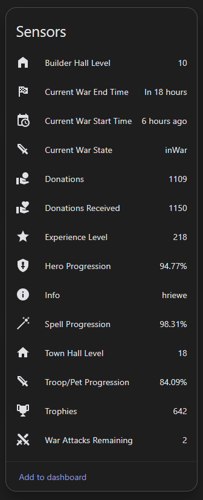
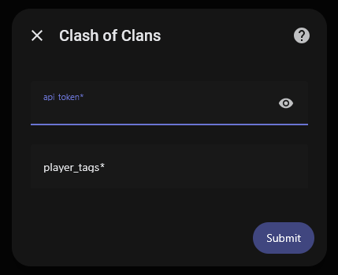

# Clash of Clans – Home Assistant Integration

Custom Home Assistant integration for exposing Clash of Clans data from the official API as sensors.

  

## Features
- Easy to manage entities (One device per player tag)
- Player trophies, town hall, league, and many other stats
- Clan war state and timing
- HACS compatible
- UI configuration (no YAML)
- Easy to create automations and scripts using the entities
- [Companion Lovelace card](https://github.com/hriewe/lovelace-clash-of-clans)

## Installation (HACS)
1. HACS → Integrations
2. Custom repositories
3. Add `https://github.com/hriewe/ha-clash-of-clans`
4. Category: Integration
5. Install "Clash of Clans"
6. Restart Home Assistant
7. Settings -> Devices & Services -> Integrations -> Add Integration -> Clash of Clans

## Configuration

  

- You will need an API Token from [developer.clashofclans.com](https://developer.clashofclans.com) (see [notes](#notes))
- Player Tag (e.g. `#2V2V2V2V`) Comma seperate to add multiple accounts

## Notes
- Your Home Assistant IP must be whitelisted in the Clash of Clans developer portal
    - You can find your Home Assistants public IP address by running `curl https://api.ipify.org` in your terminal if you have the Terminal add-on installed (strongly recommended)
    - Otherwise, it's likely your router's public IP address which can be found at [whatismyip.com](https://whatismyip.com) (Note: This is subject to change if your router changes its IP address. If you are having issues with the integration, try creating a new API token in the developer portal and whitelisting the IP address specifically returned by your Home Assistant instance)
- Data updates every 5 minutes

## Contributing

Contributions are welcome! Please feel free to submit a Pull Request with your ideas/fixes.

## License

See `LICENSE`.